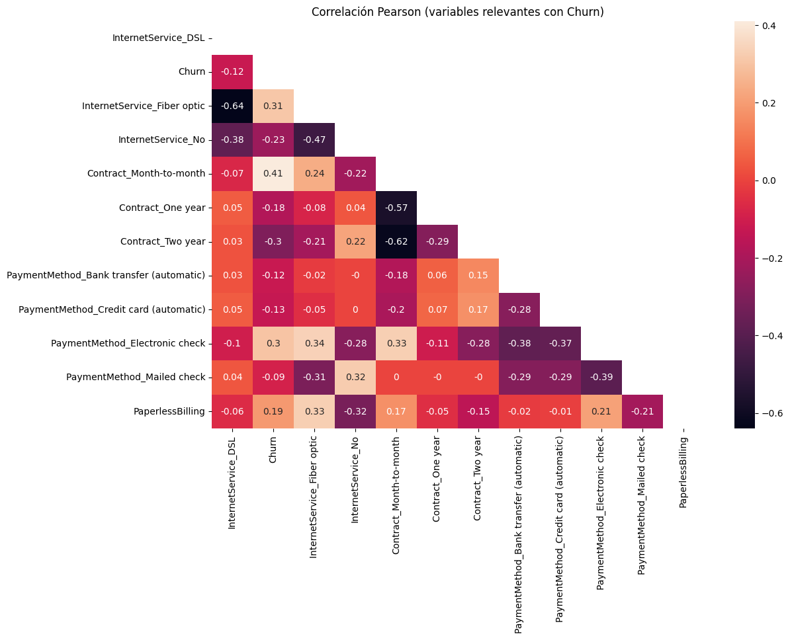
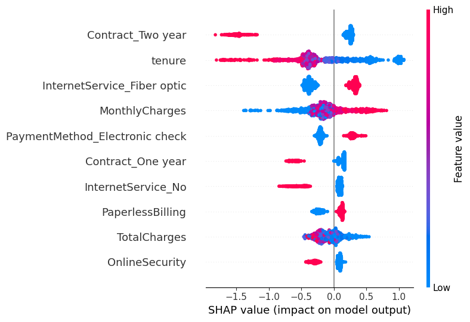

## 🛠️ Stack tecnológico


**Análisis y ML**


# Predicción de fuga de clientes en Telecomunicaciones: de reaccionar a anticiparse

Detectar que un cliente se va a marchar está bien. Pero ese dato, por sí solo, no vale nada. Lo que aporta valor es saber **a quién contactar, qué hacer con cada uno, por qué se está planteando irse y cuánto dinero deja eso sobre la mesa**.

Este proyecto no termina en un modelo con buenas métricas: termina en una herramienta que un equipo comercial puede abrir un lunes por la mañana y usar para trabajar.

## Contenido

Para abordar el problema respondemos a cuatro preguntas:

1. [¿Cuál es el problema?](#cuál-es-el-problema)
2. [¿Qué se ha hecho?](#qué-se-ha-hecho)
3. [¿Por qué se va cada cliente?](#por-qué-se-va-cada-cliente)
4. [¿Cuánto vale esto en euros?](#cuánto-vale-esto-en-euros)
5. [¿Cómo se usa en el día a día?](#cómo-se-usa-en-el-día-a-día)

Y para cerrar:

- [En resumen](#en-resumen)
- [Stack tecnológico](#-stack-tecnológico)
- [Instalación y ejecución en local](#instalación-y-ejecución-en-local)

### ¿Cuál es el problema?

La empresa pierde alrededor de un **26,5% de sus clientes**. El problema no es solo esa cifra, sino *cuándo* se detecta: hoy la compañía se entera de que un cliente se va cuando ya ha llamado para darse de baja. En ese momento la decisión ya está tomada y el margen de maniobra es mínimo.

Y retener importa. Captar un cliente nuevo puede costar hasta **25 veces más** que conservar uno existente, y una mejora de apenas 5 puntos en la tasa de retención puede elevar los beneficios entre un 25% y un 100%.

El objetivo, por tanto, no es solo reducir la fuga: es **cambiar el momento en el que la empresa se entera**. Pasar de reaccionar a anticiparse.

### ¿Qué se ha hecho?

Se ha construido un modelo capaz de estimar, para cada cliente de la cartera, su probabilidad de abandono **antes de que se produzca**. El modelo detecta **8 de cada 10 clientes que realmente se van**, dando margen para actuar.

Pero antes de predecir hay que entender. El análisis de los datos ya deja señales claras:



Tres factores concentran el riesgo: el **servicio de fibra óptica**, el **contrato mes a mes** y el **pago mediante cheque electrónico**. En el lado opuesto, el contrato a dos años y la antigüedad son los mejores escudos contra la fuga.


Un hallazgo incómodo: existe un grupo de clientes de **alto valor y mucha antigüedad** que se está yendo. De los 157 clientes que forman ese perfil, **151 tienen fibra óptica**. No es un problema comercial: es un problema de producto que la dirección debería mirar de cerca.

### ¿Por qué se va cada cliente?

Saber quién se va no basta. Un comercial que llama sin saber *por qué* está llamando a ciegas.



El modelo explica, **cliente a cliente**, qué factores concretos empujan su decisión. Eso convierte una llamada genérica en una conversación con argumentos. Traducido a probabilidades reales:

| Perfil del cliente | Probabilidad de fuga |
|---|---|
| Contrato a dos años | **3%** |
| Factura electrónica | **33%** |
| Internet por fibra óptica | **41%** |
| Pago con cheque electrónico | **45%** |

Al cruzar estos perfiles aparece un patrón: el cliente de riesgo tiende a ser **digital y poco atado** (contrata online, paga online, sin permanencia). Es un cliente cómodo comparando ofertas, y por eso un servicio de fibra deficiente le pesa más que a nadie.

### ¿Cuánto vale esto en euros?

Un modelo no se defiende con métricas, se defiende con dinero. Por eso el proyecto cuantifica el retorno de la campaña de retención.

La estrategia **no trata a todos los clientes igual**: reserva la llamada telefónica (cara, pero efectiva) para el riesgo alto, y el correo electrónico (barato) para el riesgo moderado. El punto de corte entre ambas acciones no se elige a ojo, se calcula buscando el máximo beneficio.

El resultado: por **cada euro invertido** en la campaña de retención se recuperan cerca de **9 euros**, incluso contando el dinero gastado en clientes que no pensaban irse.

Además, la solución no impone una única forma de trabajar. La empresa puede elegir su nivel de agresividad:

| Estrategia | Fugas detectadas | Inversión | Beneficio neto |
|---|---|---|---|
| **Agresiva** | 90% | Mayor | Máximo |
| **Equilibrada** | 80% | Media | Alto |
| **Selectiva** | 59% | Mínima | Menor |

La eficiencia por euro se mantiene estable en los tres casos: lo que cambia es cuánto valor total se rescata. La decisión deja de ser técnica y pasa a ser lo que debe ser: **una decisión de negocio**.

### ¿Cómo se usa en el día a día?

El proyecto se materializa en un cuadro de mando pensado para el equipo comercial, no para un analista. Con él, un agente puede:

- Ver **qué clientes contactar**, ordenados por urgencia.
- Saber **qué acción hacer con cada uno** (llamada o email).
- Entender **por qué** ese cliente está en riesgo, para preparar el argumentario.
- **Ajustar la estrategia** con dos controles y ver el impacto al instante.
- **Registrar cada contacto** y dejar notas para la siguiente aproximación.

🔗 **[Ver el dashboard en funcionamiento](https://telcochurnappif.streamlit.app/)**

### En resumen

| | |
|---|---|
| **Problema** | 26,5% de fuga detectada demasiado tarde |
| **Solución** | Predicción anticipada + estrategia de retención diferenciada |
| **Cobertura** | 8 de cada 10 fugas detectadas a tiempo |
| **Retorno** | ~9 € por cada euro invertido |
| **Entregable** | Cuadro de mando operativo para el equipo comercial |

---

## INSTALACIÓN Y EJECUCIÓN EN LOCAL

Para ejecutar el proyecto en local, sigue estos pasos.

1. Clonar el repositorio

```bash
git clone https://github.com/ivanfondo/Portafolio-Data-Science-Python.git
cd Portafolio-Data-Science-Python/PrediccionChurnTelco
```

 2. Crear y activar un entorno virtual

Se recomienda usar un entorno virtual para aislar las dependencias del proyecto.

**En Windows (PowerShell):**
```bash
python -m venv .venv
.venv\Scripts\Activate.ps1
```

**En Windows (CMD):**
```bash
python -m venv .venv
.venv\Scripts\activate.bat
```

**En macOS / Linux:**
```bash
python -m venv .venv
source .venv/bin/activate
```

Cuando el entorno esté activado, verás `(.venv)` al principio de la línea de comandos.

 3. Instalar las dependencias

```bash
pip install -r requirements_base.txt
```

4. Ejecutar el notebook

```bash
TelcoChurn.ipynb
```

Contiene el análisis exploratorio, la construcción y comparación de los modelos, la explicabilidad con SHAP y el análisis económico. Puedes abrirlo con Jupyter, VS Code o cualquier editor compatible con notebooks.

 5. Ejecutar el dashboard en local (opcional)

```bash
streamlit run app_churn.py
```

El dashboard se abrirá automáticamente en el navegador.
