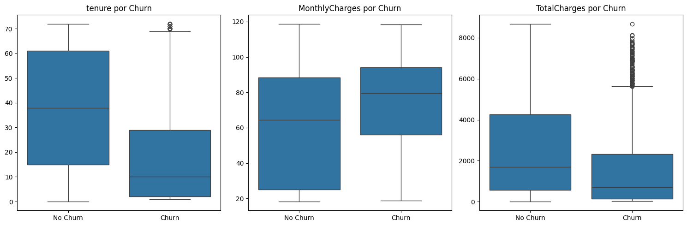

# Predicción Churn en Telecomunicaciones: ¿Por qué se van los clientes?

Tras haber realizado el análisis y modelado para conseguir construir un modelo que permita detectar por que se van los clientes hay preguntas que responder. Construir un modelo y ser capaz de detectar un cliente que se va a ir está bien, pero ese dato por si solo no aporta ningún tipo de valor. Más allá de saber quien se va o quien se queda, hay que saber los motivos por el cuál un cliente decide irse.

Para abordar el problema vamos a hacernos 3 preguntas:
- ¿Cuál es el problema?
- ¿Que se ha realizado?
- ¿Cuál es el objetivo?

### ¿Cuál es el problema?

Tal como se ha mencionado ya, el problema es la fuga de clientes, aunque los datos en esta empresa muestran que sólo alrededor del 30% de los clientes se fugan, lo ideal es conseguir reducir este porcentaje. Si bien es cierto que se pueden conseguir nuevos clientes, en un sector como las telecomunicaciones es más sencillo buscar retener clientes que conseguir nuevos clientes. 

### ¿Que se ha realizado?

Para abordar este problema se ha realizado en primer lugar un análisis exploratorio para entender los datos, antes de empezar a construir cualquier algoritmo que ayude a predecir si un cliente se va, es necesario saber como se comportan los datos y como es su forma. Cómo los datos se encuentran en parte en formato STR, hay que codificarlos, esta codificación llevará dará lugar a un aumento de la dimensionalidad, es decir, en número de variables va aumentar. Esto se debe a que algunas de las variables que se encuentran en el dataset tienen más de 2 opciones por tanto toca aplicar un OneHotEncoding.

Una vez codificados los datos y tras un primer visual empleando la librería ydata_profiling, se construye una matriz de correlación entre las variables binarias para ver como se comportan estas con la variable objetivo "Churn". 

De esta matriz se obtiene información clave como que el servicio de fibra óptica, un tipo de contrato mes a mes y el uso del cheque electrónico como método de pago tienen una fuerte relación con la fuga del cliente, siendo el punto contrario tener un contrato a dos años o una elevada antigüedad.

Dado que la matriz solo muestra la correlación entre variables binarias, para enriquecer el contenido del EDA se construyen unos diagramas de cajas con las variables continuas.

De este gráfico se obtiene que hay un segmento de clientes con unos cargos totales elevados que se están fugando. Cómo los clientes tienen cargos totales elevados se presupone que también tienen una elevada antigüedad. Filtrando los datos se obtiene alrededor de 157 clientes que representan esos outliers. De estos, 151 tienen contratado el servicio de fibra óptica. Esto lleva a la conclusión de que hay que tener un ojo puesto en el servicio de fibra óptica.

Tras el EDA se procede a separar los datos en un conjunto de entrenamiento y otro de test. Cómo el primer algorimto empleado, la regresión logística, necesita datos escalados, se procede a escalar las variables continuas.

Una vez se encuentran separados y escalados, se construye el algoritmo. El primer algoritmo se emplea cómo modelo base y se emplean todas las variables, será el propio algoritmo el que decida que variables le resultan relevantes para el modeo y cuales no. 
Despúes de perfeccionar el modelo se construyen las métricas, para las métricas se empleará la curva ROC AUC, que será la métrica estrella en estos modelos de predicción. Se pondrá especial atención en el recall(sensibilidad) y se mostrarán los resultados en una matriz de confusión.

Este proceso se repitre varias veces ya que los algoritmos empleados son la regresión logística ya mencionada, el random forest y por último XGBoost.

Una vez se ha determinado que modelo emplear, haciendo uso de la librería SHAP se muestra como y que variables afectan para saber si un cliente se fuga o se queda.

### ¿Cuál es el objetivo?

Como se ha mencionado, el objetivo no solo es saber quien se fuga, también hay que saber porque se fugan. La ya mencionada librería SHAP es nuestro gran aliado para esta situación. Poder saber los principales motivos que provocan la fuga de los clientes permite al equipo de marketing crear diferentes estrategias para abordar al cliente e intentar evitar la fuga.

### Conclusiones

El gráfico que devuelve SHAP muestra que factores influyen en la fuga de más a menos importante. Tal como se aprecia en la matriz de correlación, el contrato a dos años es la variable más relevante para evitar la fuga de un cliente seguido de la antigüedad del cliente.

Para obtener unos datos más claros, se construye una tabla de probabilidades en base a la variable Churn, de donde obtenemos:
- La probabilidad de que un cliente se fuge si ha firmado un contrato a dos años es del 3%, es decir, sólo 3 de cada 100 clientes se van con esta modalidad de contrato.
- Si el método de pago empleado es el cheque electrónico, las probabilidades de fuga son de un 45%. Este dato, muestra como este método de pago que consiste en rellenar los datos de forma manual cada 30 días en la web de la empresa crea una fuerte restricción.
- Si el internet contratado es fibra óptica, las probabilidades de fuga son del 41%. Mejorar este servicio no recae en el equipo de marketing, esto es una medida que debe afrontar la directiva de la empresa.
- Otro dato a destacar es como aquellos clientes que reciben factura electrónica tienen una probabilidad de fuga del 33%. 

Observando las 3 principales variables binarias que más probabilidad tienen en la fuga se puede llegar a la conclusión de que este tipo de cliente podría pertenecer a una franja de cliente jóven. Este tipo de cliente tiene mayor facilidad a la hora de contratar servicios, principalmente online dado su soltura para defenderse con este formato. Esta soltura dará lugar a que busque siempre el mejor servicio al mejor precio y ahí es donde el mal servicio de la fibra óptica está jugando un papel relevante.

### NOTA
Para ejecutar el notebook, se recomienda emplear un entorno virtual:
1. Crear entorno: `python -m venv venv`
2. Activar entorno: 
   - Windows: `.\venv\Scripts\activate`
   - Mac/Linux: `source venv/bin/activate`
3. Instalar librerías: `pip install -r requirements.txt`