# Pricing en retail: elasticidad y optimización de precio

Estimación de la **elasticidad precio-demanda** de un producto de refrescos a partir
de datos reales de scanner, y uso de esa elasticidad para **optimizar el precio**
(ingreso y margen). Es un proyecto de *pricing*, no solo de previsión de demanda:
el objetivo no es únicamente predecir cuánto se venderá, sino entender cómo responde
la demanda al precio y qué precio conviene poner.

## Datos

**Dominick's Finer Foods** — datos de scanner a nivel de tienda y semana recogidos por
una cadena de supermercados del área de Chicago entre 1989 y 1997. Es uno de los pocos
conjuntos públicos aptos para pricing con rigor: incluye precio, unidades vendidas,
margen del minorista y código de promoción, y en su origen contiene experimentos de
precio.

- **Categoría analizada:** refrescos (*soft drinks*).
- **Producto seleccionado:** Pepsi Cola 2 L (UPC 1200000230), elegido por combinar alto
  volumen, presencia en la mayoría de las tiendas y variación de precio suficiente para
  identificar la elasticidad. Coca-Cola y Diet Coke (mismo formato) quedan reservadas
  para una posible extensión a elasticidad cruzada entre marcas.

Los datos **no se incluyen en el repositorio** (pesan y no son redistribuibles). Para
reproducir el proyecto, descargar y colocar en `data/raw/`:

- `wsdr.csv` y `upcsdr.csv` — ficheros de movimiento y catálogo de la categoría de
  refrescos, desde el [Kilts Center](https://www.chicagobooth.edu/research/kilts/research-data/dominicks).
- `weeks.csv` — mapa de semana → fecha, desde el repositorio [eurostat/dff](https://github.com/eurostat/dff)
  (carpeta `CSV/`).

## Estructura del proyecto

```
Pricing-Dominicks/
├── data/                
│   ├── raw/              
│   ├── interim/          
│   └── processed/        
├── notebooks/
│   ├── 01_eda_limpieza.ipynb
│   ├── 02_grupo_reducido_stl.ipynb
│   ├── 03_demanda_elasticidad.ipynb
│   ├── 04_ml_features_opt.ipynb
│   ├── 05_comparacion_oos.ipynb
│   ├── 06_optimizacion_precio.ipynb
│   └── 07_escalado.ipynb
├── src/                  
├── reports/figures/      
├── requirements.txt
├── .gitignore
└── README.md
```

## Enfoque

El proyecto avanza sobre un grupo reducido (un producto) y escala al final. Las fases:

1. EDA y limpieza.
2. Descomposición STL para entender la serie. 
3. Setup de evaluación y marco de pricing (target, horizonte, validación, métrica; y la
   pregunta de pricing: ingreso vs margen, control de confusores).
4. Modelo de demanda con precio → elasticidad (regresión log-log con controles).
5. Modelo de ML (LightGBM) con features de precio + optimización de hiperparámetros.
6. Comparación fuera de muestra y validación de la curva de demanda.
7. Optimización de precio (maximizar ingreso o margen).
8. Escalado a más productos y cierre.

## Hallazgos del EDA 

**La relación precio–cantidad existe y es clara.** En escala log-log la nube de puntos
(todas las combinaciones tienda·semana) desciende de forma limpia: a mayor precio, menor
cantidad. La pendiente de un ajuste ingenuo es de aproximadamente **−4,0**.

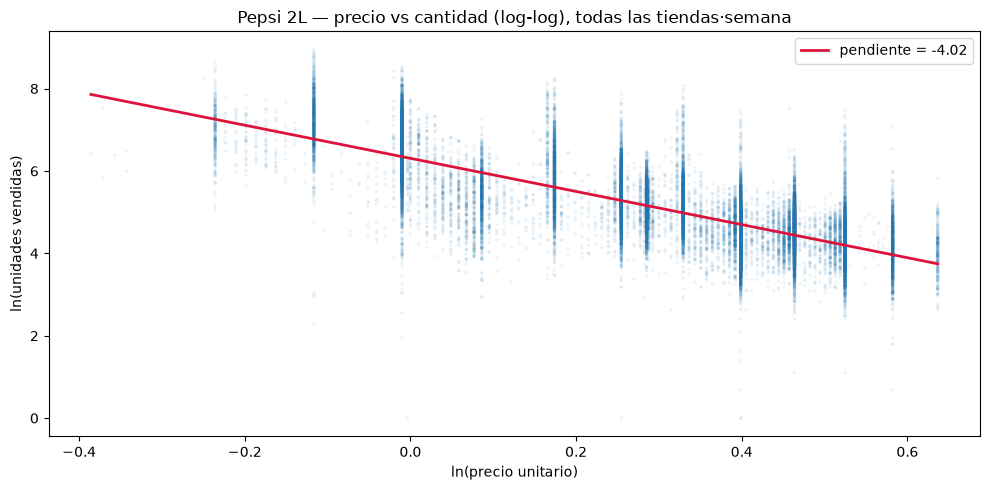

**Ese −4,0 está inflado y no es la elasticidad final.** El ajuste ingenuo no controla
nada y, sobre todo, confunde el efecto del precio con el de la promoción: los precios
bajos son casi siempre semanas de promoción, que venden más también por el cartel y el
expositor, no solo por el precio. Al colorear la nube según haya promoción se ve el
gradiente con claridad: la promoción se concentra a precios bajos (más ventas) y el
precio regular a precios altos (menos ventas). La estimación honesta de la elasticidad
se obtendrá en la fase 4, al introducir los controles, y se espera que atenúe respecto
a este valor.

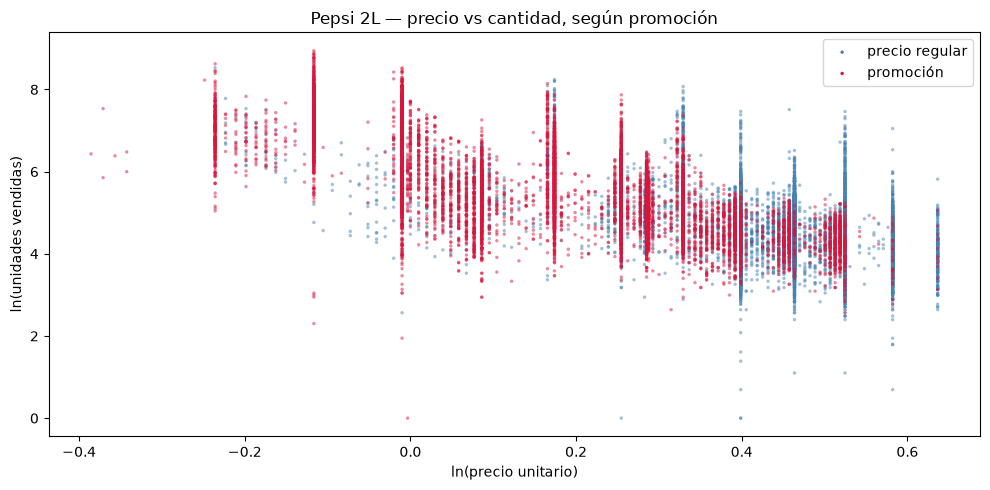

**La demanda tiene un suelo estacional suave dominado por picos promocionales
irregulares.** La serie semanal agregada está gobernada por picos agudos de una sola
semana que no siguen calendario (son promociones, no estación); la estacionalidad anual
(menos refrescos en invierno) aparece solo en el nivel base. Para pricing esto es
favorable: casi toda la variación de precio es de origen comercial, que es justo el
combustible para estimar elasticidad.

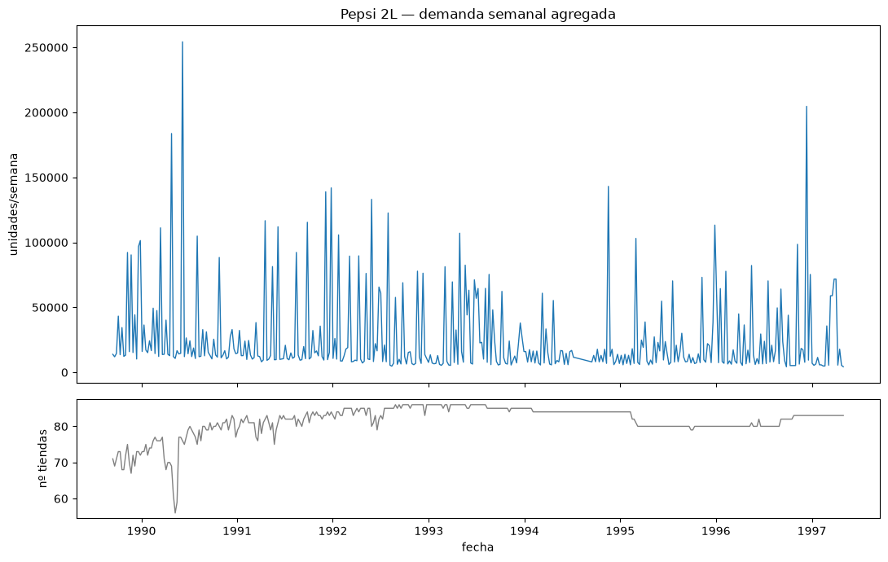

**El precio se agrupa en escalones discretos, y regular y promoción se solapan.**
Dominick's manejaba unos pocos precios de lista; las promociones empujan el precio por
debajo. Es importante que exista una franja de precios donde conviven semanas regulares
y promocionales: ese solape es lo que permitirá a la regresión separar el efecto del
precio del efecto de la promoción (sin él, ambos serían indistinguibles).

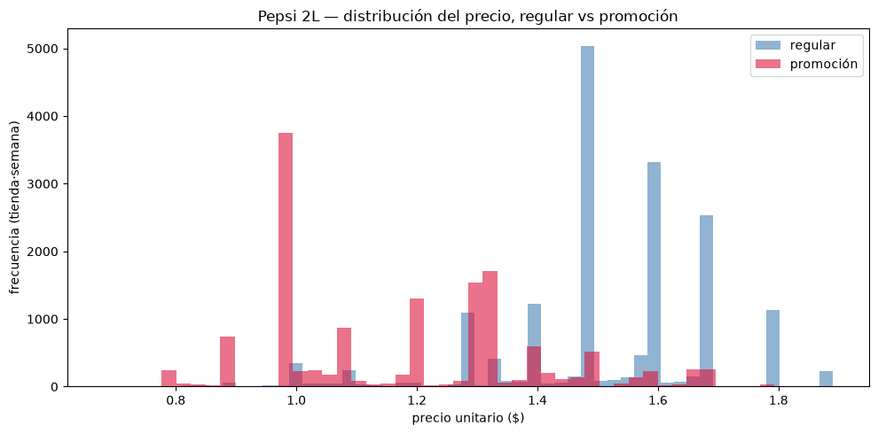

**Limpieza aplicada:** se descartaron los registros marcados como poco fiables por el
proveedor (flag `OK`, ~1,4 %, casi todos con precio 0) y las observaciones con precio 0
(semanas sin venta del producto). Se conservan las variables de promoción (`SALE`),
festividad (`special`) y tienda como controles para la fase de modelado. Nota de
identificación pendiente para la fase 4: el flag `SALE` no está registrado de forma
consistente, por lo que el precio regular se reconstruirá sin depender solo de él.

## Descomposición STL 

Una vez los datos están limpios, es momento de descomponer la serie para entender las componentes que la forman. Siguiendo la línea del notebook anterior, la descomposición se realiza sobre un único producto, lo que simplifica el análisis.

Antes de descomponer se busca un punto de corte en el que el número de tiendas se estabilice; el seleccionado es a partir de 1991.

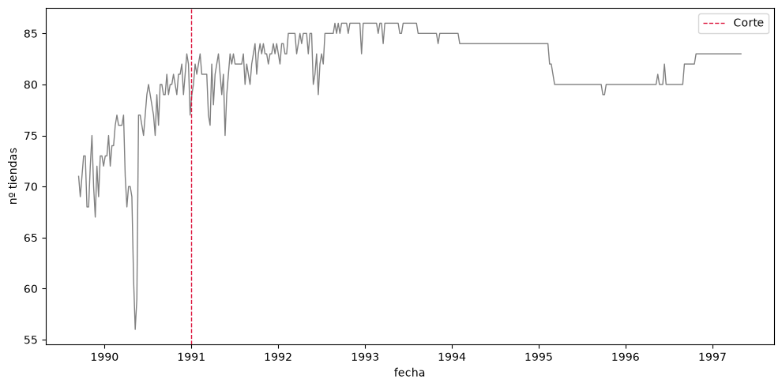

Aún con el corte, el número de tiendas no es constante en el tiempo, por lo que usar la suma de unidades para analizar la serie confundiría dos cosas: la demanda real y cuántas tiendas la registran. Para evitarlo se calcula la media de unidades por tienda, que refleja el nivel de demanda típico por tienda con independencia de cuántas haya cada semana. En esta ventana la diferencia entre suma y media es casi irrelevante, pero se emplea la media por robustez.

`STL` necesita una serie regular y sin huecos. La serie tiene 9 semanas sin registros, que se interpolan. Además, como `STL` es una descomposición aditiva (asume oscilaciones de tamaño constante) y la serie parece multiplicativa (las fluctuaciones crecen con el nivel), hay que transformarla.

Para decidir la transformación se probó primero `Box-Cox`, que devolvió λ ≈ −0,60, lejos del 0 que correspondería al logaritmo. Descartando que fueran los picos, se repitió sin el 1% superior de valores y el resultado empeoró (−0,61). La conclusión no es que la transformación falle, sino que `Box-Cox` responde a otra pregunta: optimiza la normalidad de toda la distribución, no la estabilización de la varianza que necesitamos, y en una serie con suelo bajo y picos tiende a valores sin lectura útil.

La comprobación adecuada es la relación entre nivel y dispersión: al trocear la serie y enfrentar la media de cada tramo con su desviación típica, los puntos crecen en diagonal con una correlación de 0,86. Eso confirma que la serie es multiplicativa y que el logaritmo es la transformación correcta —además de ser la escala natural de la elasticidad—. Se aplica, por tanto, el logaritmo y se interpola sobre él.

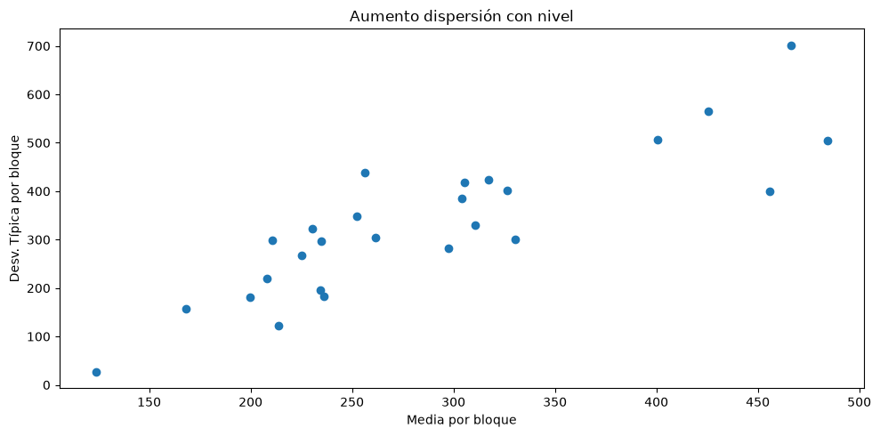

De la descomposición se extraen estas conclusiones:

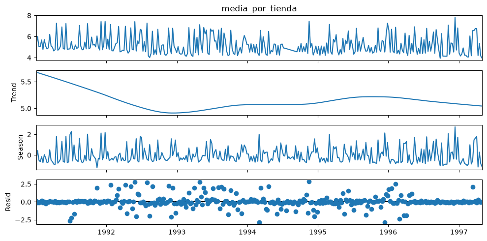

- La tendencia es limpia y legible: cae al inicio de la serie, se recupera y se aplana.
- La estacionalidad no se captura de forma limpia; no refleja periodos estacionales claros, es decir, no se repiten los mismos patrones cada año.
- El residuo, salvo puntos concretos, está muy centrado. Ese es el problema de fondo: las promociones no se recogen en el residuo, sino que se trasladan a la componente estacional (el `STL`, forzado a un ciclo de 52 semanas, confunde con estación las promociones que caen en fechas recurrentes).

La conclusión es que la descomposición no sale limpia porque la principal fuente de variación de la demanda son las promociones, algo que no encaja en ninguna de las tres componentes. El contraste de medias lo confirma: en semanas con promoción la componente estacional pasa de −0,21 (sin promo) a +0,21, y el residuo de −0,19 a +0,31. Es la evidencia de que ese empuje promocional se reparte entre ambas componentes. `STL` ha cumplido su función: mostrar que esta serie no es temporal en esencia, sino dirigida por el precio, lo que motiva el modelo de la fase siguiente.

## Elasticidad precio-demanda

El objetivo de esta fase es estimar la elasticidad precio-demanda de Pepsi: en qué porcentaje varía su demanda ante un cambio del 1% en el precio. El planteamiento es progresivo, de una regresión ingenua a un modelo con controles, observando cómo se ajusta la elasticidad en cada paso.

La regresión ingenua (`ln_q ~ ln_p`), sin ningún control, da una elasticidad de **−4,07**, que reproduce la relación ya vista en el EDA.

Al intentar añadir la promoción surge el primer problema. La bandera basada en la columna `SALE` resultó poco fiable (el propio manual advierte de que no se rellena de forma consistente): había semanas marcadas como promoción al precio más alto del histórico. Su coeficiente salía con un signo incoherente, síntoma de una variable mal construida. Se descartó y se optó por reconstruir la información de precio mediante *feature engineering*.

La reconstrucción define un **precio regular de referencia** por tienda —el percentil 90 del precio en una ventana móvil de 13 semanas— y una **profundidad de descuento** como la caída del precio respecto a esa referencia. Esto separa dos efectos que antes se confundían: el nivel de precio regular y la intensidad de la promoción. Con esta especificación, el efecto del descuento pasa a ser **+4,07** (positivo y muy significativo), coherente con el fuerte efecto promocional del EDA, y la elasticidad se sitúa en **−4,18**.

Sobre esta base se añaden más controles. El festivo resulta significativo pero de efecto despreciable. Los **efectos fijos de tienda** sí mueven la elasticidad, de −4,18 a **−3,78**, al absorber diferencias estables entre establecimientos (zona, tamaño, clientela) que antes
se atribuían en parte al precio; el R² sube a 0,72.

El valor resultante sigue siendo alto porque es una **elasticidad de marca**: mide la respuesta de Pepsi a su propio precio con los sustitutos disponibles, no la de la categoría en conjunto. Por eso, como extensión, se incorpora el precio del rival directo, Coca-Cola, reconstruido igual que el de Pepsi. La **elasticidad cruzada** resulta **+0,91** (positiva y significativa): confirma que son sustitutos —si Coca sube un 1%, la demanda de Pepsi aumenta un 0,91%—. Al controlar por el rival, la elasticidad propia de Pepsi no se atenúa sino que se acentúa hasta **−4,62**, porque los precios de ambas marcas se mueven juntos y, sin controlar el del rival, la elasticidad aparecía amortiguada.

## Predicción de demanda mediante ML

El objetivo de esta fase es generar una predicción de la demanda mediante `LightGBM`. Para simplificar esta primera iteración se trabaja sobre una serie agregada (media de unidades por tienda y semana) en lugar de sobre los datos de panel. Al promediar el precio entre tiendas se pierde la variación entre establecimientos que sí se explotó al estimar la elasticidad (fase 3), pero aquí no es un problema: el objetivo es predecir la demanda agregada, no estimar el efecto causal del precio.

Sobre la serie agregada se analizan la **autocorrelación (ACF)** y la **autocorrelación parcial (PACF)**. Ambas son prácticamente planas, lo que muestra que la demanda apenas se explica por sus propios valores pasados y confirma, una vez más, que el motor de la serie no es la inercia temporal sino el precio y la promoción.

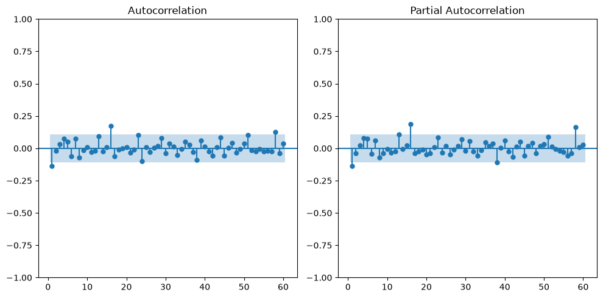

Antes de entrenar el modelo de ML se establece un conjunto de modelos de **benchmark** (Naive, Seasonal Naive y AutoETS) que solo usan el pasado de la demanda, sin información de precio. Sirven de listón: si el modelo con precio no los supera, no estaría aportando valor. Como anticipaba el ACF plano, los modelos de referencia rinden mal en el backtesting sobre train (mejor MAE = 260, AutoETS), no porque sean malos en sí, sino por la naturaleza de la serie, donde la demanda pasada no basta para anticipar la futura.

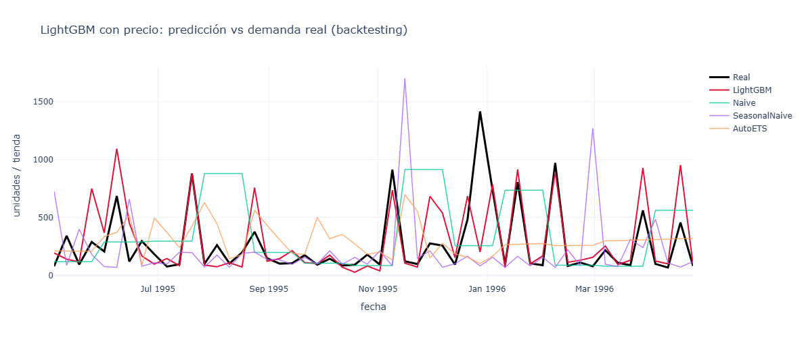

El `LightGBM` **sin optimizar** ya mejora por sí solo el mejor benchmark de train en torno a un 48% (MAE 260 → 136). Este es el salto relevante, y es esperable: el modelo incorpora el precio y el descuento, no solo la demanda pasada. La **optimización** por búsqueda bayesiana lo refina de 136 a 121 de MAE: una mejora fina (–11%), no sustancial.

**Resultados en backtesting de origen deslizante (sobre train):**

| Modelo                    | MAE | RMSE |
|---------------------------|----:|-----:|
| Naive                     | 320 | 445  |
| Seasonal Naive            | 268 | 449  |
| AutoETS                   | 260 | 346  |
| LightGBM sin optimizar    | 137 | 242  |
| **LightGBM optimizado**   | **121** | **227** |

Todas las decisiones anteriores se toman con backtesting sobre el conjunto de entrenamiento. Solo entonces se evalúa **una única vez sobre el test** (el último año, intacto hasta este punto), obteniendo un **MAE de 182**. El salto respecto al 121 del backtesting no es una alarma y tiene dos causas: el backtesting reentrenaba el modelo en cada ventana (`refit=True`) mientras que el test no (`refit=False`), y el periodo de test es intrínsecamente más volátil (media 317 vs 282, desviación 429 vs 344). Además, el test contiene un pico excepcional (diciembre de 1996, el más alto de toda la serie) que el modelo subestima. El contraste entre MAE (182) y RMSE (327) lo confirma: el error no está repartido, sino concentrado en unos pocos picos. El 182 es el número honesto; el 121 era optimista.

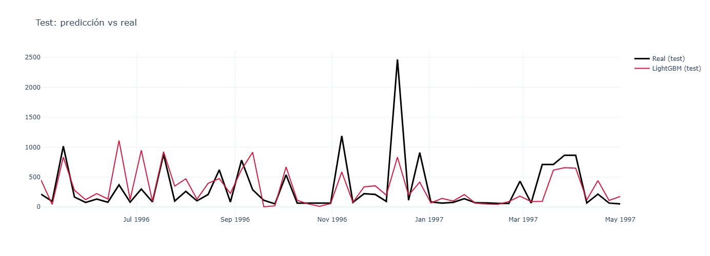

Ese 182, sin embargo, no es comparable con el 260 de los benchmarks: aquel es de test y este de backtesting sobre train. Para un veredicto justo se evalúan también los modelos de referencia sobre el test, y el mapa cambia. AutoETS, el mejor en train, se desploma a 313: su estructura suave de nivel y estacionalidad no encaja con un periodo volátil y con picos. El mejor benchmark en test pasa a ser Seasonal Naive (267), que engancha parte de los picos al repetir la semana equivalente del año anterior, no por ser mejor modelo, sino porque su mecanismo tosco casa con la recurrencia de calendario de las promociones.

**Resultados sobre el conjunto de test (todos los modelos, mismo protocolo):**

| Modelo                  | MAE | RMSE |
|-------------------------|----:|-----:|
| **LightGBM optimizado** | **182** | **327** |
| Seasonal Naive          | 267 | 473  |
| AutoETS                 | 313 | 455  |
| Naive                   | 468 | 804  |

En igualdad de condiciones, el `LightGBM` mantiene una ventaja amplia: 182 frente a 267 del mejor benchmark, un 31% menos de error. Los RMSE lo refuerzan: los baselines fallan de forma catastrófica en los picos (Seasonal Naive salta de 267 a 473; Naive, de 468 a 804), mientras que el LightGBM los acusa mucho menos. La lección de método es que "el mejor benchmark" depende del protocolo de evaluación: solo evaluando a todos sobre el mismo test la comparación es honesta, y es esa comparación la que confirma que incorporar el precio mejora sustancialmente la predicción de la demanda.

Por último, para dar transparencia al modelo de caja negra se calculan los valores **SHAP** sobre la serie completa. Confirman que la variable dominante es, con mucha diferencia, el `DESCUENTO`, por encima del `PRECIO_REF` (construido en la fase 3) y del precio de Coca-Cola; los lags de demanda quedan por debajo de todos ellos. Conviene matizar la lectura: que `PRECIO_REF` pese poco no significa que la demanda sea insensible al precio, sino que el precio *regular* apenas varía en estos datos (por construcción). La acción del precio llega por la vía del descuento, que no deja de ser una bajada de precio. Es plenamente coherente con la elasticidad estimada en la fase 3.

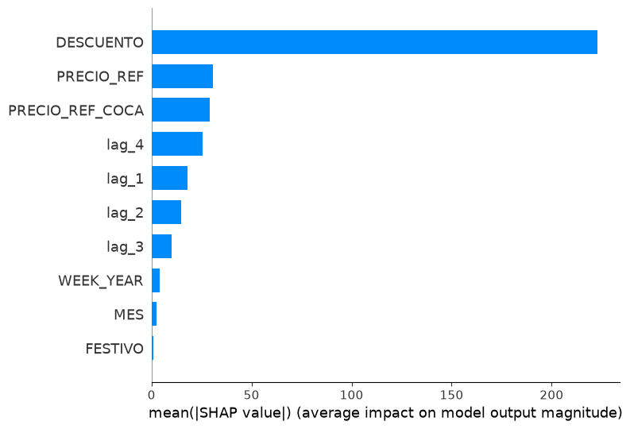

El gráfico de dependencia del `DESCUENTO` refuerza el hallazgo: la relación es creciente y de gran magnitud, y los descuentos más efectivos tienden a coincidir con un precio de Coca-Cola alto, un eco no paramétrico de la elasticidad cruzada con el rival.

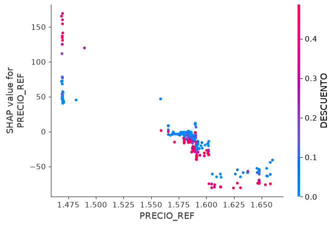

**Uso a futuro (what-if).** Como el modelo predice la demanda a partir del precio y el descuento, proyectar fuera del histórico exige fijar un escenario de precios: no existe "la predicción a futuro" a secas, sino la demanda condicionada a un plan de precios. Se ilustra comparando dos escenarios a 4 semanas (el horizonte avalado por el backtesting) —sin promoción frente a un 20% de descuento—, con intervalos de predicción por bootstrap de residuos. El descuento casi duplica la demanda esperada, a costa de una banda más ancha: más venta esperada, pero también más incertidumbre. Este what-if condicional es la antesala directa de la optimización de precio.

## Validación de la curva de demanda

La relación precio-demanda se ha estimado por dos vías independientes: la regresión log-log, que impone elasticidad constante y resume la respuesta en un parámetro ($e$ = −4,62), y el modelo LightGBM, que la aprende sin imponer forma funcional. Esta fase las contrasta para validar que ambas describen la misma relación.

Se construye la curva de demanda implícita de LightGBM mediante un análisis what-if: se fija una semana representativa (cada variable en su mediana) y se barre el precio a través del descuento, dentro del rango observado, prediciendo la demanda en cada punto. La curva resultante se superpone a la recta log-log de la regresión, comparando en escala logarítmica, donde la elasticidad es la pendiente.

El resultado valida la relación: la elasticidad implícita de LightGBM (−4,24) coincide en la práctica con la de la regresión (−4,62), una diferencia de apenas 0,38 puntos entre dos métodos radicalmente distintos. La pequeña discrepancia es coherente —la curva del ML se
construye sobre la serie agregada con el rival fijo, una situación algo menos elástica que el panel con efectos fijos de la regresión— y la forma escalonada de la curva del ML refleja su capacidad para capturar no linealidades que la recta, por construcción, no ve.

La conclusión operativa es que se dispone de una curva de demanda validada por dos caminos independientes, con fundamento sólido para la optimización de precio de la fase siguiente, siempre dentro del rango de precios analizado (fuera de él, ninguna de las dos curvas es
fiable).

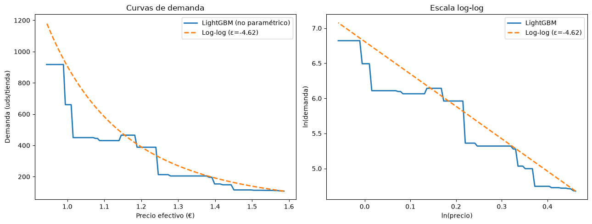

## Reproducibilidad

```bash
python -m venv .venv
# Windows: .\.venv\Scripts\Activate.ps1
pip install -r requirements.txt
```

Ejecutar los notebooks en orden numérico. El `01` produce
`data/processed/pepsi_2l.parquet`, que consumen los siguientes.

## Estado

- Notebook 01 — EDA y limpieza: completado.
- Notebook 02 — Descomposición STL: completado.
- Notebook 03 — Elasticidad Precio-Demanda: completado
- Notebook 04 — Modelo de demanda con ML (LightGBM): completa. 
- Notebook 05 - Validar curva de demanda: completa
- (En Curso) - Notebook 06 - Optimización precio

## Fuente de datos

Este trabajo utiliza datos de Dominick's Finer Foods facilitados por el **Kilts Center
for Marketing, University of Chicago Booth School of Business**. Datos para uso
académico. El mapa de semanas procede del repositorio eurostat/dff.