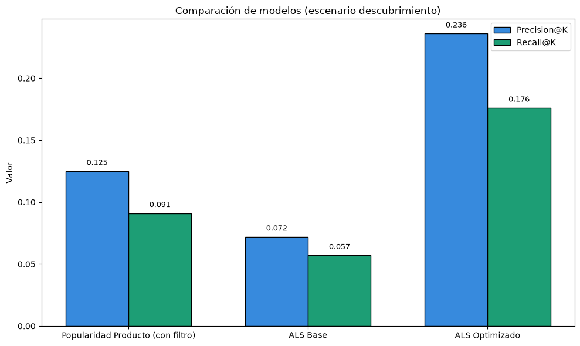
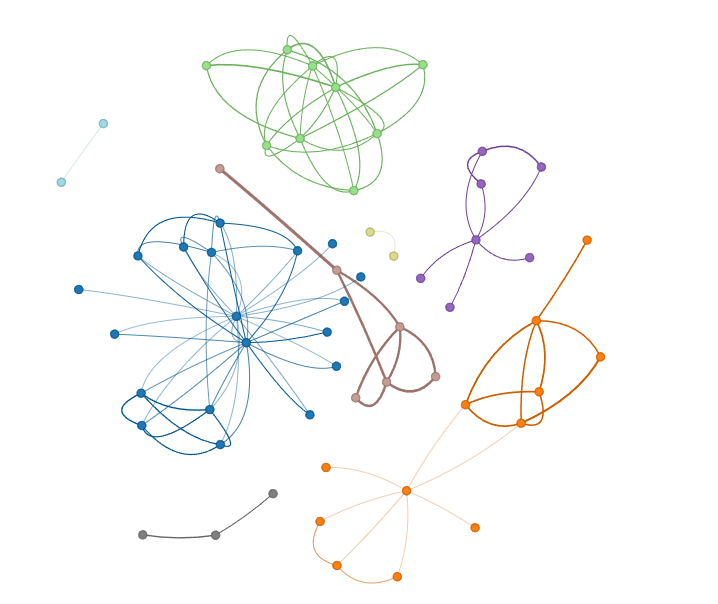
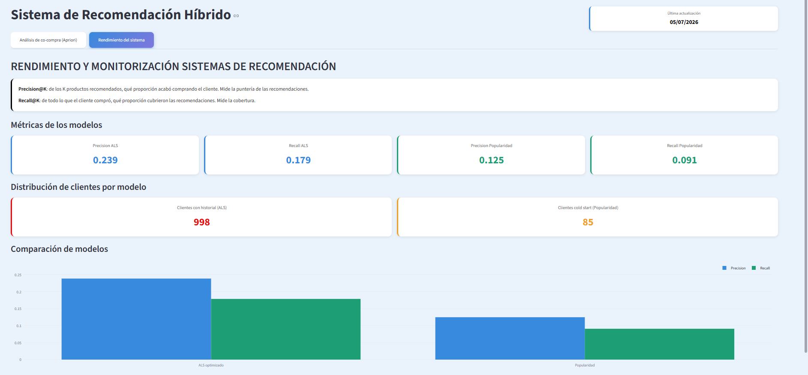

## SISTEMA DE RECOMENDACIÓN HÍBRIDO Y ALGORITMO APRIORI PARA INTELIGENCIA DE NEGOCIO


[](https://monitorizacionsistemarecomendacion.streamlit.app/)

Uno de los principales problemas que se puede encontrar un negocio en el sector retail es buscar aumentar la fidelización de los clientes y por consiguiente las ventas. Este problema, puede ser abordado desde diferentes perspectivas, pero en esta ocasión, el planteamiento es realizar recomendaciones personalizadas a los clientes.

El sistema analiza el historial de compra de cada cliente para identificar sus patrones de consumo y, a partir de ellos, generar un listado de productos afines a sus preferencias. Estas recomendaciones se envían mediante correo electrónico con el objetivo de incentivar un mayor consumo.. La frecuencia y relevancia de las recomendaciones son clave: un exceso de comunicaciones o sugerencias poco acertadas puede resultar contraproducente y generar rechazo hacia la marca.

Hacer recomendaciones personalizadas es importante, pero tal vez no todos los clientes hagan uso de su correo electrónico. Para ello, se enfoca el problema desde otra perspectiva, la inteligencia de negocio, es decir, conocer la relación de compra entre los productos nos permite tomar decisiones estratégicas a la hora de realizar promociones o colocar productos en las tiendas, buscando crear un efecto gancho, en donde se busca generar una necesidad al cliente para que compre productos complementarios, logrando de esta manera aumentar el ticket medio.

---
# Tabla contenido

* [Contexto](#contexto)
* [Desarrollo sistema recomendación](#desarrollo-sistema-recomendación)
* [Apriori para inteligencia de negocio](#apriori-para-inteligencia-de-negocio)
* [Dashboard monitorización](#dashboard-monitorización)
* [Consideraciones para producción](#consideraciones-para-producción)
* [Ejecutar notebooks](#ejecutar-notebooks)

---

### CONTEXTO
El problema se ha planteado para una superficie comercial, en donde el objetivo es realizar recomendaciones entre visitas. Los datos empleados han sido generados de forma sintética, por tanto nos enfrentamos a situaciones que no se dan en la realidad. Entre estas situaciones nos encontramos con datos totalmente limpios, algo que en la realidad nunca se va a dar. Los datos reales presentarían patrones menos diferenciados y más ruidosos, mientras que en este dataset sintético los perfiles de cliente están deliberadamente bien diferenciados para facilitar el aprendizaje de los modelos.

Estas situaciones se tienen muy presentes en el desarrollo de todo el ejercicio.

### DESARROLLO SISTEMA RECOMENDACIÓN 
El sistema de recomendación se plantea con dos perspectivas, que van de menor a mayor complejidad. El sistema menos complejo se basa en recomendaciones no personalizadas, en donde se desarrolla un modelo de recomendación sobre popularidad de productos. Este primer modelo nos sirve como punto de inicio y resuelve un problema, el cold start. Este problema se da cuando hay nuevos clientes que no cuentan con historial y por tanto no se pueden realizar recomendaciones personalizadas.

Para desarrollar este sistema se aplica un filtro en donde se busca hacer recomendaciones nuevas, es decir, que las recomendaciones generadas no sean productos que el cliente ya ha comprado, por tanto nos enfocamos en hacer descubrimiento de productos a los clientes.

Una vez terminado el sistema basado en popularidad, se procede a desarrollar un sistema ALS (Alternating Least Squares), que se trata de un sistema personalizado. Este algoritmo se enfoca en descubrir gustos ocultos. 
La idea central es la factorización de matrices, en donde se parte de una matriz cliente-producto, una tabla, que en entornos reales, suele estar prácticamente vacía. Esto se debe principalmente al número de productos, en donde no todos los clientes van a comprar todos los productos, sino que cada uno se va a enfocar en una serie de productos. En la matriz de este ejercicio, como el número de productos es menor, la matriz tendrá una mayor densidad. ALS se encarga de descomponer esta matriz en dos matrices más pequeñas, una de clientes y otra de productos, descritas por factores latentes. Un factor latente es una característica oculta que el modelo inventa para explicar los datos.

Para medir los resultados de los modelos, se usan como referencia las métricas Precision@K y Recall@K, siendo la precision la métrica de referencia.
- Precision@K nos indica de los K productos recomendados, que proporción de ellos ha comprado el cliente. Mide la puntería de las recomendaciones.
- Recall@K: de todo lo que compró el cliente, que proporción cubrieron las recomendaciones. Mide la cobertura.

El principal problema que presenta el Recall aquí, es que está limitado. Si trabajamos con 10 recomendaciones y el cliente ha comprado muchos más productos, el recall nunca podrá alcanzar el 100%, ya que es imposible cubrir todas sus compras con solo 10 recomendaciones. Por ello, se interpreta como métrica comparativa entre modelos más que por su valor absoluto.
Con estas métricas, se puede hacer una comparación de resultados en modelos. En este caso, el modelo ALS optimizado mediante Optuna alcanza una Precision@10 de 0.24, prácticamente el doble que el baseline de popularidad (0.12), lo que confirma que la personalización aporta valor cuando existe diferenciación entre clientes.
Partiendo del modelo basado en popularidad como base, si ALS no consigue mejorar los resultados, habría que replantearse si realmente tiene sentido hacer una implementación de ese modelo.



Una vez se han comparado los modelos, se crea un sistema en cascada. Este sistema en cascada es lo que hace que cada modelo se active en el momento necesario, es decir, si estamos ante un cliente con historial, el modelo aplica una recomendación personalizada basada en ALS, en caso contrario, estamos ante un cliente sin historial, la recomendación se hace mediante popularidad.

Para consumir los resultados, se genera un archivo CSV, que sería cargado en el CRM que use la empresa.


### APRIORI PARA INTELIGENCIA DE NEGOCIO
El algoritmo Apriori se puede emplear como sistema recomendador, pero en el contexto en el que se sitúa este ejercicio, el enfoque se centra en entender cómo se relacionan los productos y buscar definir una estrategia de colocación o promoción dentro de las tiendas. El algoritmo se centra en el análisis de las cestas de compra para crear perfiles.

Para este algoritmo, no hay una métrica objetivo que sea optimizable como en ALS, al contrario, como se basa en reglas, el criterio con el que se aplican las mismas dependerá de las decisiones que la persona encargada del negocio considere mejor.
Tres métricas que se pueden observar y actúan como reglas son:
- Support: frecuencia de aparición de la combinación en las cestas. En este ejercicio se aplica un mínimo del 3%.
- Confidence: indica la confianza con la que se compran los productos. Es importante ser cauteloso con este valor, ya que una confianza del 90% no indica que los productos resulten complementarios. Alguien que compra agua puede comprar un snack con una confianza del 80% por ejemplo, pero pueden mostrar un lift de 1.05, siendo una compra meramente casual. Se indica un valor mínimo del 50%
- Lift: métrica estrella. Mide la fuerza de asociación entre productos. Lo ideal es que este valor sea superior a 1, cuanto más grande sea, más fuerte es la asociación entre productos. Si el valor es igual a 1 los productos presentan independencia total entre ellos, la relación es aleatoria. Si el valor es inferior a 1, en vez de actuar como productos complementarios, actúan como productos sustitutivos. Se aplica un valor mínimo de 2.

La necesidad de aplicar reglas no solo es una decisión de negocio, también es necesario para poder filtrar ya que el modelo posiblemente genere un elevado número de reglas que resulte poco manejable. Al reducir el número de reglas mediante los filtros, se puede generar un grafo dinámico que muestra de una forma más amigable el comportamiento de los productos. 




Es posible interactuar con el grafo en el siguiente enlace: https://ivanfondo.github.io/Portafolio-Data-Science-Python/SistemaRecomendacionHibrido/dashboard/grafo_cocompra_v2.html

Los resultados del algoritmo permiten detectar 8 clusters.

- Grupo 1: perfil fiesta/aperitivos
- Grupo 2: perfil cocina/frescos
- Grupo 3: perfil bebé
- Grupo 4: perfil hogar/droguería
- Grupo 5: perfil mascotas
- Grupo 6: perfil desayuno
- Grupo 7: perfil café
- Grupo 8: perfil pasta

El resultado matemático devuelve 8 tipos de perfiles pero es importante tener en cuenta que esta parte se desarrolla con un enfoque de inteligencia de negocio, lo que nos lleva al siguiente punto. Si se observa el grupo 7 y 8, nos podemos dar cuenta de que son dos grupos que se pueden fusionar con el grupo 2 y grupo 6. La decisión final sobre el número de grupos que vamos a identificar reside en la persona que toma las decisiones de negocio. 

La identificación de grupos ayuda en gran medida a orientar las decisiones y el conocimiento humano es un criterio muy importante a tener en cuenta para dar un mayor contexto a los resultados.

### DASHBOARD MONITORIZACIÓN
Finalmente se construye un dashboard para monitorizar el grafo y el comportamiento de las métricas. Para este ejercicio el dashboard se despliega en Streamlit y cuenta con dos pestañas, cada una de ellas enfocada al grafo y otra a la monitorización de los resultados en los modelos.

En este caso, todos los valores se encuentran estáticos (se introducen a mano). Lo correcto es generar archivos CSV que vayan almacenando el histórico para poder hacer comparaciones y ser capaz de detectar cuando se produce data drift. 



Se puede interactuar con el dashboard desde este enlace: https://monitorizacionsistemarecomendacion.streamlit.app/

### CCONSIDERACIONES PARA PRODUCCIÓN
Como ya se ha mencionado, se trabaja con datos estáticos, por tanto solo hay un entrenamiento. Para llevar esto a un entorno real es necesario estructurar el código en varios scripts. Por un lado, módulos que encapsulan los modelos y transforman los datos. Por otro, un script de entrenamiento y otro de inferencia, separados porque tienen frecuencias de uso distintas.
La frecuencia de uso distinta se debe principalmente a que el entrenamiento es un proceso muy costo, por tanto se realizaría una vez al mes.

El pipeline de trabajo quedaría de la siguiente forma:
```
 pipeline/
├── config/
│   └── params.json          # Hiperparámetros del modelo (editable sin tocar código)
├── src/
│   ├── data.py              # Carga de datos y split temporal
│   ├── models.py            # Modelos: ModeloPopularidad y ModeloALS
│   └── recommender.py       # Cascada híbrida + evaluación
├── models/                  # Modelos entrenados + histórico de métricas (generado)
├── output/                  # CSV de recomendaciones (generado)
├── train.py                 # SCRIPT 1: entrena y guarda los modelos
└── predict.py               # SCRIPT 2: genera recomendaciones y exporta CSV
```

### EJECUTAR NOTEBOOKS

## INSTALACIÓN Y EJECUCIÓN EN LOCAL

Para ejecutar el proyecto en local, sigue estos pasos.

1. Clonar el repositorio

```bash
git clone https://github.com/ivanfondo/Portafolio-Data-Science-Python.git
cd Portafolio-Data-Science-Python/SistemaRecomendacionHibrido
```

 2. Crear y activar un entorno virtual

Se recomienda usar un entorno virtual para aislar las dependencias del proyecto.

**En Windows (PowerShell):**
```bash
python -m venv .venv
.venv\Scripts\Activate.ps1
```

**En Windows (CMD):**
```bash
python -m venv .venv
.venv\Scripts\activate.bat
```

**En macOS / Linux:**
```bash
python -m venv .venv
source .venv/bin/activate
```

Cuando el entorno esté activado, verás `(.venv)` al principio de la línea de comandos.

 3. Instalar las dependencias

```bash
pip install -r requirements_base.txt
```

4. Ejecutar los notebooks

Los notebooks están numerados según el orden de lectura recomendado:

1. `1_EDARecomendacion.ipynb` — análisis exploratorio de los datos.
2. `2_SistemaHibridoLimpio.ipynb` — desarrollo del sistema de recomendación (popularidad, ALS y cascada).
3. `3_Apriori.ipynb` — análisis de cesta de la compra (inteligencia de negocio).

Puedes abrirlos con Jupyter, VS Code o cualquier editor compatible con notebooks.

 5. Ejecutar el dashboard en local (opcional)

```bash
streamlit run dashboard/dashboard.py
```

El dashboard se abrirá automáticamente en el navegador.